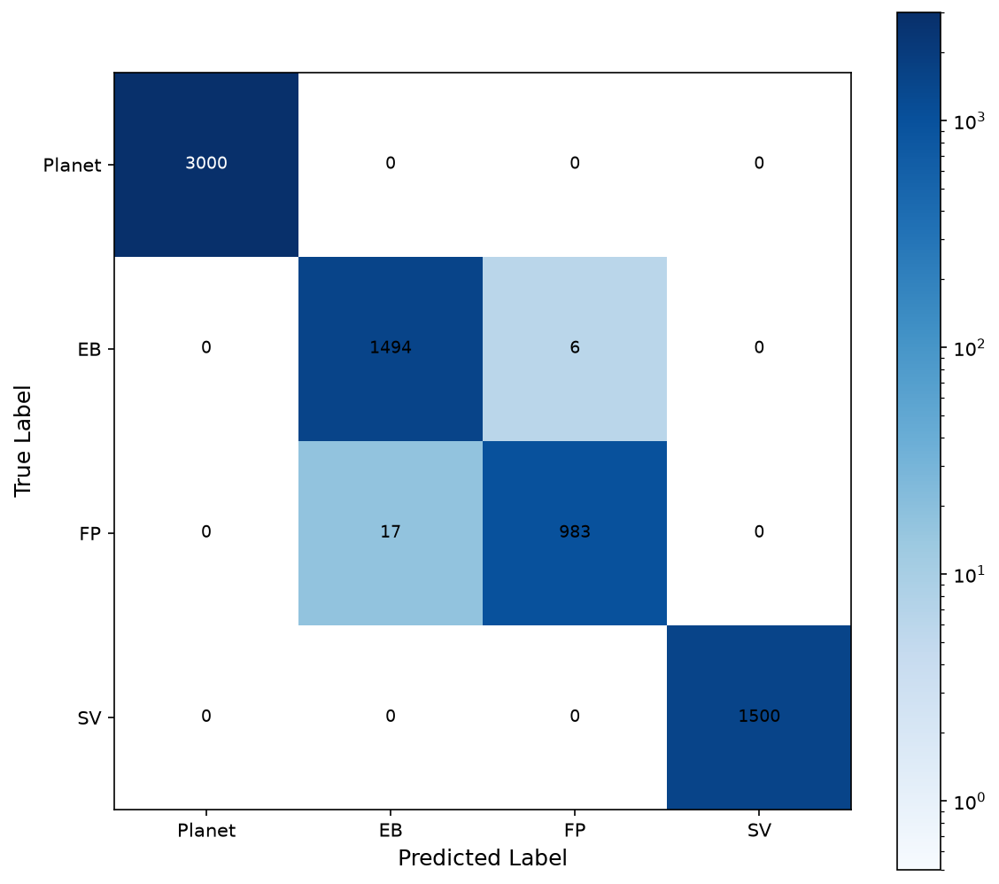
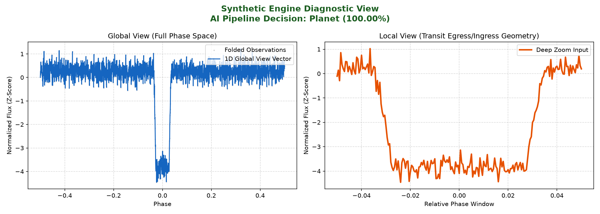

# TESS Exoplanet Classifier

A 1D dual-branch CNN that classifies TESS light curves to help astronomers triage exoplanet transit candidates faster. Built as part of **ISRO Bharatiya Antariksh Hackathon 2026** by Team XOclipse.

> **Project status:** Active prototype. Core pipeline (data acquisition, preprocessing, training, evaluation, inference) is functional and validated on synthetic data. Validation on real TESS light curves is in progress.

---

| [Classification](#classification-scope) | [Architecture](#architecture) | [Setup](#setup) | [Pipeline](#pipeline) | [Project Structure](#project-structure) | [Roadmap](#roadmap) | [License](#license) |
|---|---|---|---|---|---|---|

## Classification Scope

### Current Prototype (4-Class)

The working prototype classifies each light curve into four classes, designed for fast astronomer triage:

| Class | Label | Description |
|---|---|---|
| 0 | **Planet** | Genuine planetary transit signal |
| 1 | **Eclipsing Binary (EB)** | V-shaped dip from a binary star system |
| 2 | **False Positive / Artifact (FP)** | Instrumental noise or systematic artifact |
| 3 | **Stellar Variability (SV)** | Noise from intrinsic stellar activity |

This 4-class scheme was chosen for the hackathon prototype because it directly maps to the most common *causes* of false positives that astronomers need to distinguish during manual triage, and it keeps the training dataset size and class balance manageable for a rapid build cycle.

### Final Intended Design (6-Class — Planned)

The production target is a 6-class scheme that maps one-to-one with the official **TESS Objects of Interest (TOI)** disposition taxonomy used by NASA's archive, so classifier outputs can be directly cross-referenced against the public catalog:

| Code | Disposition |
|---|---|
| CP | Confirmed Planet |
| KP | Known Planet (previously confirmed via Kepler/other missions) |
| PC | Planet Candidate |
| APC | Astrophysical Candidate (likely real signal, not yet a planet) |
| FP | False Positive |
| FA | False Alarm |

Migrating to this scheme is the next development milestone. It requires a larger, more granular labeled dataset (the current 4-class catalog collapses several of these categories together) and will improve interoperability with downstream astronomer workflows that already use TOI disposition codes.

---

## Architecture


- **Global view branch**: processes the full folded light curve (2001 time steps) through 3 convolutional blocks to capture long-term orbital behavior.
- **Local view branch**: processes a zoomed-in transit window (201 time steps) through 2 convolutional blocks to capture fine-grained transit geometry.
- **Merged head**: concatenated features from both branches → 3 fully-connected layers with dropout → softmax output (currently 4-way; architecture is extensible to 6-way as the labeled dataset expands).


---

## Setup

```bash
pip install -r requirements.txt
```

## Pipeline

### 1. Create catalog (CSV → labeled catalog)
```bash
python create_catalog.py
```

### 2. Download light curves and build dataset
```bash
python build_dataset.py
```
Supports checkpoint resume. Use `--no-resume` to start fresh:
```bash
python build_dataset.py --no-resume
```

### 3. Train
```bash
python train.py
```
Configurable options:
```bash
python train.py --dataset data/processed/training_dataset.pt --epochs 100 --lr 5e-5
```

### 4. Evaluate
```bash
python evaluate.py
```



### 5. Run inference (synthetic demo)
```bash
python predict.py
```



### Custom paths
All scripts accept `--dataset`, `--weights`, and `--batch-size` arguments where applicable.

---

## Project Structure

```
├── build_dataset.py       # Download TESS light curves & save as .pt
├── create_catalog.py      # Build labeled catalog from raw CSV
├── train.py                # Train the model
├── evaluate.py             # Evaluate on test set
├── predict.py               # Inference with synthetic data
├── src/
│   ├── model.py            # ExoplanetDualBranchCNN definition
│   └── utils.py             # Shared constants and helpers
├── data/
│   ├── raw/                 # Raw CSV and .pt files
│   └── processed/           # Catalogs and training datasets
└── weights/                 # Trained model weights
```

---

## Roadmap

- [x] 4-class synthetic + real-data pipeline (preprocessing, training, evaluation, inference)
- [x] Offline synthetic data fallback engine
- [ ] Expand labeled catalog to support full 6-class TOI disposition taxonomy
- [ ] Validate model performance on held-out real TESS light curves (not just synthetic data)
- [ ] Migrate softmax output layer from 4-way → 6-way classification

---

## License

Apache-2.0
